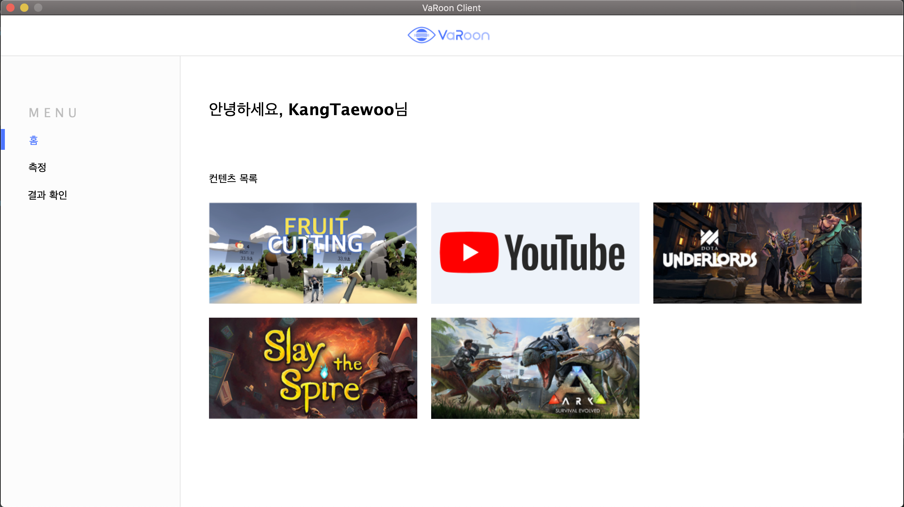

# VaRoon Client

SW Maestro 10기 Tri_Catch 팀 VaRoon 프로젝트

목표: 사시 측정 및 치료 컨텐츠를 실행할 수 있는 클라이언트 개발

## Development environment

IDE: IntelliJ IDEA / Language: Java

## Getting Started

1. Install IntelliJ IDEA
2. Build Project

## Architecture

### Controller.java

> 로그인 화면과 메인 화면을 제어
>
> - showMain(String token, String role, String name): 로그인 화면을 닫고 메인화면을 켜는 함수

### Login.java

> 로그인 화면: 로그인 또는 회원가입이 가능한 화면.

### Main.java

> 메인 화면: 측정, 치료 컨텐츠를 실행하고 웹페이지로 넘어가서 차트를 볼 수 있는 화면

## Screen

